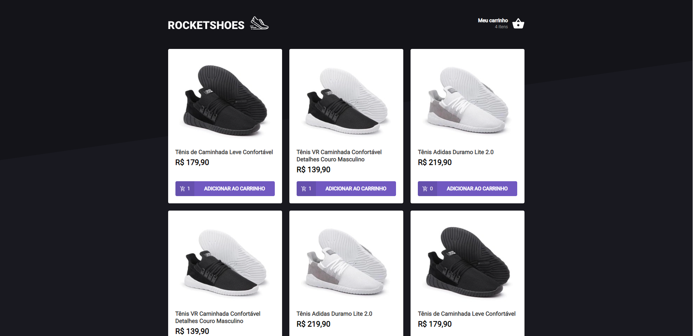

<h1 align="center">
    
</h1>

<br>

## 👟 RocketShoes

RocketShoes é uma aplicação, onde você consegue adicionar ou remover, novos produtos ao carrinho de compras.
- Adicionar um novo produto ao carrinho;
- Remover um produto do carrinho;
- Alterar a quantidade de um produto no carrinho;
- Cálculo dos preços sub-total e total do carrinho;
- Validação de estoque;
- Exibição de mensagens de erro;
- Entre outros.


Esta aplicação foi construida, durante o curso IGNITE da RocketSeat.

## 🛠 Tecnologias

Esse projeto foi desenvolvido com as seguintes tecnologias:

- ReactJS
- Typescript
- JSON Server
- Styled-components


## 🚀 Como executar

Clone o projeto e acesse a pasta do mesmo.

```bash
$ git@github.com:luizsmatos/rocketshoes.git
$ cd rocketshoes
```

Para iniciá-lo, siga os passos abaixo:
```bash
# Instalar as dependências
$ yarn

# Iniciar o JSON Server
$ yarn server

# Iniciar o projeto
$ yarn start
```

---
